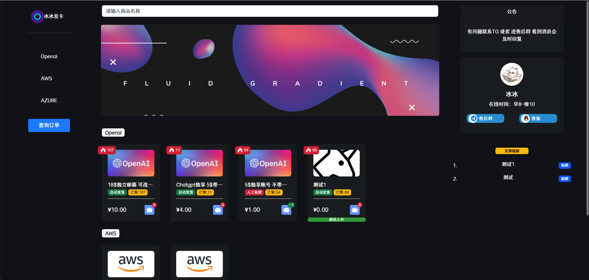

<p align="center"></p>

<p align="center">
<a href="https://opensource.org/licenses/MIT"></a>
<a href="https://github.com/assimon/dujiaoka/releases/tag/2.0.4"></a>
<a href="https://www.php.net/releases/7_4_0.php"></a>
</p>

## 独角数卡

⭐开源式站长自动化售货解决方案、高效、稳定、快速！

⭐本项目提供了一个基于Docker的一键部署，帮助用户轻松搭建自己的发卡站。

⭐在原版基础上增加更好的容器化部署支持，增加更多的主题可供选择。

⭐本项目fork自动化售货系统-独角数卡[assimon/dujiaoka](https://github.com/assimon/dujiaoka)的最新源码，保持同步更新。

## 主题预览
【unicorn模板】


【luna模板】 


【hyper模板】  


【bing模板】  


## Docker部署

如果使用已经部署好的数据库和redis，可选择使用脚本创建容器，推荐使用编排方式更好维护。

#### 1.脚本
```sh 
install_faka(){
  
    faka_home=$HOME/faka
    
    mkdir -p $faka_home/{uploads,storage}
    
    # get .env
    wget https://raw.githubusercontent.com/ozshen/dujiaoka_reea/master/.env -O $faka_home/env.conf
    
    chmod -R 775 env.conf storage uploads
    
    # enable https
    # sed -i 's/^ADMIN_HTTPS=.*/ADMIN_HTTPS=true/' $faka_home/env.conf
  
    docker run -d --name dujiaoka \
    -e INSTALL=true \
    -v $faka_home/env.conf:/dujiaoka/.env \
    -v $faka_home/uploads:/dujiaoka/public/uploads \
    -v $faka_home/storage:/dujiaoka/storage \
    -p 55501:80 \
    --network=bridge \
    --restart=always \
    devashen/dujiaoka:latest
} install_faka
```

#### 2.编排 `docker-compose.yaml`

```yaml
version: "3"

services:
  web:
    image: devashen/dujiaoka:latest
    container_name: faka-web
    environment:
        # 不需要重新安装时，将INSTALL改为false
        - INSTALL=true
    volumes:
      - ./env.conf:/dujiaoka/.env
      - ./uploads:/dujiaoka/public/uploads
      - ./storage:/dujiaoka/storage
      # 如果每次启动容器都需要运行某些命令，可将命令行置入start-hook.sh文件
      # - ./start-hook.sh:/dujiaoka/start-hook.sh
    ports:
      - 127.0.0.1:54321:80
    restart: always
 
  db:
    image: mariadb:focal
    container_name: faka-data
    restart: always
    environment:
      - MYSQL_ROOT_PASSWORD=123456789
      - MYSQL_DATABASE=dujiaoka
      - MYSQL_USER=dujiaoka
      - MYSQL_PASSWORD=123456789
    volumes:
      - ./data:/var/lib/mysql

  redis:
    image: redis:alpine
    container_name: faka-redis
    restart: always
    volumes:
      - ./redis:/data
```

#### start-hook 的示例内容：
```bash
#!/bin/sh
echo "Executing start-hook ..."
```

#### 环境变量

参照项目中的.env配置，按需要进行修改。


#### 启动服务

```bash
docker-compose up -d
```

## 默认后台

- 后台路径 `/admin`
- 默认管理员账号 `admin`
- 默认管理员密码 `admin`

## 支付接口已集成
- [x] 支付宝当面付
- [x] 支付宝PC支付
- [x] 支付宝手机支付
- [x] [payjs微信扫码](http://payjs.cn).
- [x] [Paysapi(支付宝/微信)](https://www.paysapi.com/).
- [x] 码支付(QQ/支付宝/微信)
- [x] 微信企业扫码支付
- [x] [Paypal支付(默认美元)](https://www.paypal.com)
- [x] V免签支付
- [x] 全网易支付支持(通用彩虹版)
- [x] [stripe](https://stripe.com/)

## 基本环境要求

- (PHP + PHPCLI) version = 7.4
- Nginx version >= 1.16
- MYSQL version >= 5.6
- Redis (高性能缓存服务)
- Supervisor (一个python编写的进程管理服务)
- Composer (PHP包管理器)
- Linux (Win下未测试，建议直接Linux)

## PHP环境要求

星号(*)为必须执行的要求，其他为建议内容

- **\*安装`fileinfo`扩展**
- **\*安装`redis`扩展**
- **\*终端需支持`php-cli`，测试`php -v`(版本必须一致)**
- **\*需要开启的函数：`putenv`，`proc_open`，`pcntl_signal`，`pcntl_alarm`**
- 安装`opcache`扩展

## 免责声明

独角数卡程序是免费开源的产品，仅用于学习交流使用！       
不可用于任何违反`中华人民共和国(含台湾省)`或`使用者所在地区`法律法规的用途。      
因为作者即本人仅完成代码的开发和开源活动`(开源即任何人都可以下载使用)`，从未参与用户的任何运营和盈利活动。    
且不知晓用户后续将`程序源代码`用于何种用途，故用户使用过程中所带来的任何法律责任即由用户自己承担。      

